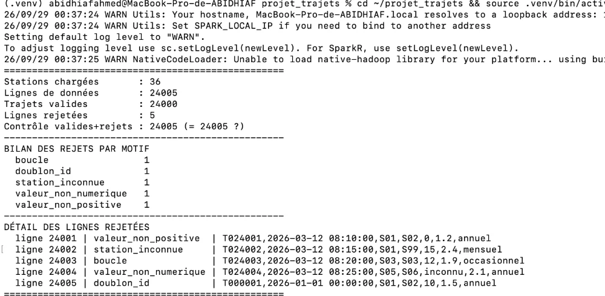
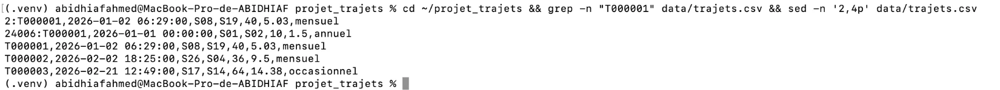
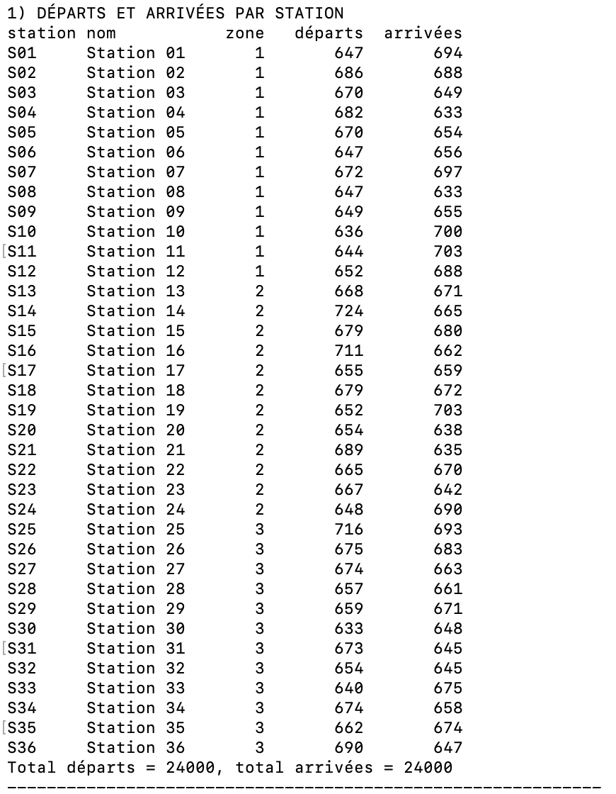
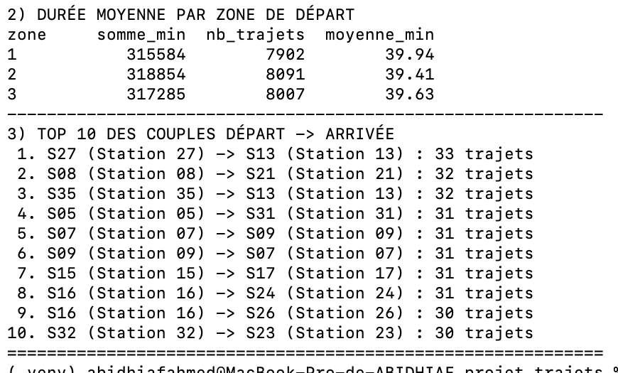
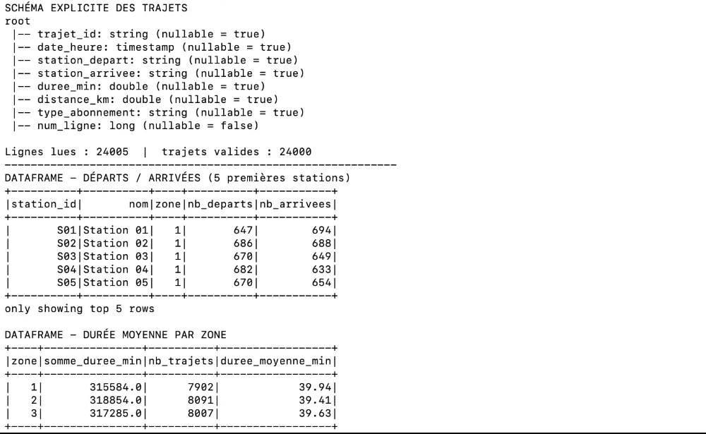
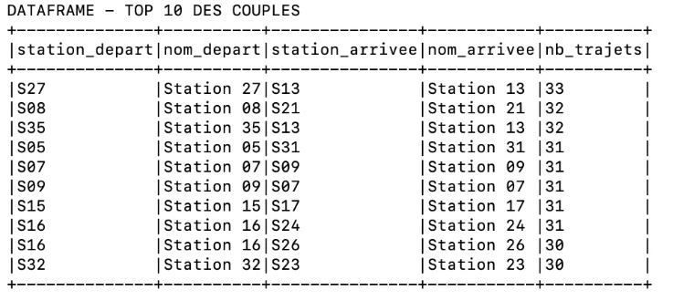
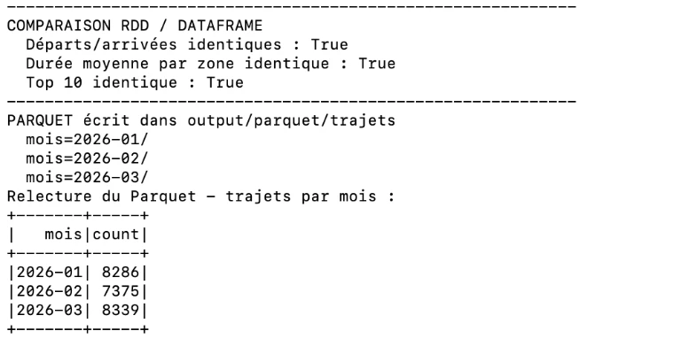
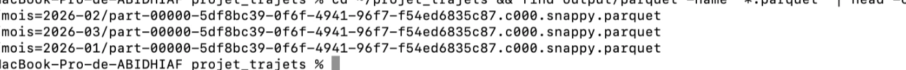
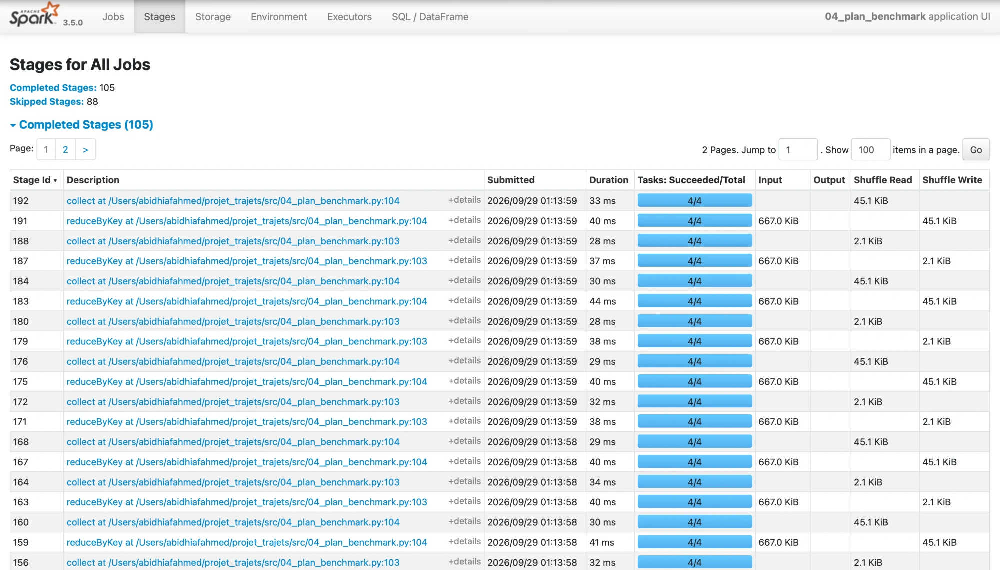
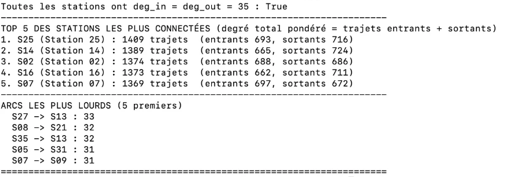

<!--
LÉGENDE
  [TOI]      = paragraphe à rédiger par Ahmed (analyse, justification, conclusion)
  [CAPTURE]  = image à placer dans ../captures/ avec le nom indiqué
  [CHIFFRES] = tableau rempli à partir des fichiers de output/
Objectif : 5 à 8 pages au total.
-->

# 1. Introduction et environnement

[TOI] 4-5 lignes : contexte (entreprise de mobilité, 3 mois de trajets), objectif du
pipeline, choix de PySpark et pourquoi.

| Élément | Version |
|---|---|
| PySpark (pip) / moteur Spark affiché | 3.5.3 / 3.5.0 |
| Python | 3.12 |
| Java | 17.0.12 |
| Mode d'exécution | local[*] (macOS) |

Commande de lancement : voir README.

# 2. Ingestion et qualité des données

## 2.1 Structure des enregistrements
[TOI] Décrire la structure typée choisie (dataclass/namedtuple) et les conversions.

## 2.2 Règles de rejet

Les règles sont appliquées dans l'ordre ci-dessous ; une ligne reçoit le motif de la
première règle qu'elle viole, ce qui garantit valides + rejetées = lignes lues.

| Ordre | Motif | Règle |
|---|---|---|
| 1 | format_invalide | 7 champs non vides attendus |
| 2 | date_invalide | `date_heure` au format `yyyy-MM-dd HH:mm:ss` |
| 3 | station_inconnue | départ et arrivée présents dans `stations.csv` |
| 4 | valeur_non_numerique | durée et distance convertibles en nombre |
| 5 | valeur_non_positive | durée > 0 et distance > 0 |
| 6 | boucle | station de départ ≠ station d'arrivée |
| 7 | doublon_id | `trajet_id` unique (voir règle ci-dessous) |

**Règle des doublons.** Lorsqu'un même `trajet_id` apparaît plusieurs fois, seule la
première occurrence dans l'ordre du fichier (numérotée avec `zipWithIndex`) est conservée.

Les deux lignes T000001 n'ont pas le même contenu : la ligne 2 est un trajet S08 → S19
le 2 janvier (40 min), la ligne 24006 un trajet S01 → S02 le 1er janvier à minuit (10 min).
Ce n'est donc pas une copie qu'on pourrait supprimer sans réfléchir, mais un conflit :
deux trajets différents avec le même identifiant. Il faut une règle pour choisir lequel garder.

Au moment de la lecture, `zipWithIndex` donne à chaque ligne son numéro de position dans le
fichier. Ce numéro ne change jamais, quelle que soit la façon dont Spark découpe les données
en partitions. En gardant toujours la plus petite position, on garde toujours la même ligne,
à chaque exécution : la règle est déterministe.

Garder la date la plus ancienne aurait été une autre option, mais elle conserverait ici la
ligne 24006 : une ligne de contrôle ajoutée en fin de fichier, datée pile de minuit le
1er janvier, donc suspecte.

L'énoncé précise que les cinq dernières lignes ne sont pas forcément les seules anomalies.
Avant d'écrire les règles, le script `00_exploration.py` a donc contrôlé tout le fichier :
nombre de colonnes (7 partout), champs vides (aucun), valeurs de `type_abonnement`
(uniquement annuel, mensuel, occasionnel), plage de dates (du 01/01 au 31/03/2026) et
vitesses moyennes (entre 7,2 et 16,8 km/h, réalistes). Aucune autre anomalie n'est apparue.

## 2.3 Bilan des rejets

| Motif | Lignes | Ligne du fichier |
|---|---|---|
| valeur_non_positive | 1 | 24001 (durée = 0) |
| station_inconnue | 1 | 24002 (S99) |
| boucle | 1 | 24003 (S03 → S03) |
| valeur_non_numerique | 1 | 24004 (durée = « inconnu ») |
| doublon_id | 1 | 24005 (T000001, déjà vu ligne 1) |
| **Total rejeté** | **5** | |
| **Trajets valides** | **24 000** | |

## 2.4 Contrôle manuel
Quelques lignes du CSV ont été vérifiées à la main et comparées au résultat du pipeline :

| Ligne | Vérification manuelle | Attendu | Pipeline |
|---|---|---|---|
| T000002 | S26 et S04 existent, 36 min et 9,5 km positifs, S26 ≠ S04 | valide | valide ✅ |
| T000003 | S17 et S14 existent, 64 min et 14,38 km positifs, S17 ≠ S14 | valide | valide ✅ |
| T000001 (ligne 2) | première occurrence de l'identifiant | gardée | gardée ✅ |
| T000001 (ligne 24006) | identifiant déjà vu ligne 2 | rejetée | `doublon_id` ✅ |

Le pipeline donne exactement le résultat attendu (capture 01).

# 3. Indicateurs avec l'API RDD

Tous les indicateurs sont calculés sur les 24 000 trajets valides (script
`02_rdd_indicateurs.py`), puis enrichis avec le nom des stations par `join`.

## 3.1 Départs et arrivées par station

Un `flatMap` transforme chaque trajet en deux événements, `((départ, "depart"), 1)` et
`((arrivée, "arrivee"), 1)`, qui sont comptés par `reduceByKey` puis séparés par `filter`.
Le résultat complet (36 stations) est dans `output/rdd_departs_arrivees.csv`.

| | Min | Max |
|---|---|---|
| Départs | 633 (S30) | 724 (S14) |
| Arrivées | 633 (S04, S08) | 703 (S11, S19) |

Contrôle de cohérence : total des départs = total des arrivées = 24 000, le nombre de
trajets valides.

## 3.2 Durée moyenne par zone de départ

Chaque trajet devient `(zone, (durée, 1))`. `reduceByKey` additionne les couples, et la
division n'est faite qu'à la fin : une moyenne de moyennes partielles serait fausse si les
partitions n'ont pas la même taille.

| Zone | Somme (min) | Trajets | Moyenne (min) |
|---|---|---|---|
| 1 | 315 584 | 7 902 | 39,94 |
| 2 | 318 854 | 8 091 | 39,41 |
| 3 | 317 285 | 8 007 | 39,63 |

Les trois zones ont des durées moyennes très proches, autour de 40 minutes.

## 3.3 Top 10 des couples départ–arrivée

| Rang | Départ | Arrivée | Trajets |
|---|---|---|---|
| 1 | S27 | S13 | 33 |
| 2 | S08 | S21 | 32 |
| 3 | S35 | S13 | 32 |
| 4 | S05 | S31 | 31 |
| 5 | S07 | S09 | 31 |
| 6 | S09 | S07 | 31 |
| 7 | S15 | S17 | 31 |
| 8 | S16 | S24 | 31 |
| 9 | S16 | S26 | 30 |
| 10 | S32 | S23 | 30 |

Quatre couples ont 30 trajets pour deux places restantes. Pour garder un classement
déterministe, les égalités sont départagées par ordre alphabétique (départ puis arrivée).
On remarque aussi que S07 → S09 et S09 → S07 sont tous les deux dans le top : c'est un axe
utilisé dans les deux sens.

# 4. API DataFrame et couche Parquet

## 4.1 Schéma explicite et indicateurs

Le script `03_dataframe_parquet.py` lit les CSV avec un `StructType` explicite : les types
(timestamp, double, string) sont déclarés au lieu d'être devinés par `inferSchema`. En mode
`PERMISSIVE`, une valeur non convertible comme la durée « inconnu » devient `null`, puis
est écartée par `dropna`. Les mêmes règles qu'en RDD sont réécrites avec des colonnes :
`left_semi` join pour les stations connues, `filter` pour les valeurs positives et les
boucles, et une fenêtre `row_number()` par `trajet_id` pour garder la première occurrence.
Résultat : **24 000 trajets valides**, comme en RDD.

Les trois indicateurs de la partie 3 ont été recalculés avec `groupBy` / `agg` / `join`.

## 4.2 Écriture Parquet partitionnée par mois

Une colonne `mois` (`yyyy-MM`) est ajoutée, puis les trajets nettoyés sont écrits avec
`partitionBy("mois")` dans `output/parquet/trajets/`. Spark crée un sous-dossier par mois ;
une requête filtrée sur un mois ne lit que le dossier concerné (*partition pruning*).

| Partition | Trajets |
|---|---|
| mois=2026-01 | 8 286 |
| mois=2026-02 | 7 375 |
| mois=2026-03 | 8 339 |
| **Total** | **24 000** |

La relecture du Parquet redonne bien 24 000 trajets.

## 4.3 Comparaison RDD / DataFrame

Le script compare automatiquement les sorties des deux versions : départs/arrivées, durée
moyenne par zone et top 10 sont **identiques** (`True` pour les trois).

| Critère | RDD | DataFrame |
|---|---|---|
| Schéma | implicite (namedtuple Python, types vérifiés à la main) | explicite (`StructType`), vérifié à la lecture |
| Conversion / erreurs | `try/except` dans une fonction Python | `null` en mode PERMISSIVE, puis `dropna` |
| Lisibilité | tuples imbriqués (`kv[1][0][2]`), plus difficile à relire | colonnes nommées, proche du SQL |
| Optimisation | aucune : Spark exécute exactement le code écrit | optimiseur Catalyst (plan logique → physique) |
| Contrôle | total, bas niveau | moins fin mais suffisant ici |
| Résultats | référence | identiques ✅ |

En pratique, la version DataFrame est plus courte et plus lisible : les colonnes ont un nom,
le schéma est contrôlé dès la lecture, et Catalyst optimise le plan sans intervention.
La version RDD reste utile pour comprendre ce que Spark fait réellement (chaque `map`,
chaque shuffle est écrit explicitement) et pour les traitements difficiles à exprimer en
colonnes, comme la validation ligne par ligne avec un motif de rejet précis. Dans ce projet,
les deux API donnent exactement les mêmes résultats.

# 5. Plan d'exécution et optimisation

## 5.1 Transformations étroites et larges
[CHIFFRES] Tableau : transformation | type | shuffle ?

## 5.2 Lecture du plan / Spark UI

[TOI] Où apparaissent les Exchange ?

## 5.3 groupByKey vs reduceByKey
[CHIFFRES] Tableau : variante | run1 | run2 | run3 | moyenne
[TOI] Interprétation prudente (petit jeu de données), rôle du partitionnement et du cache.

# 6. Graphe orienté du réseau

[TOI] Définition annoncée de « station la plus connectée ».
[CHIFFRES] Degrés entrants/sortants + top 5

# 7. Limites et conclusion

[TOI] 6-8 lignes.
