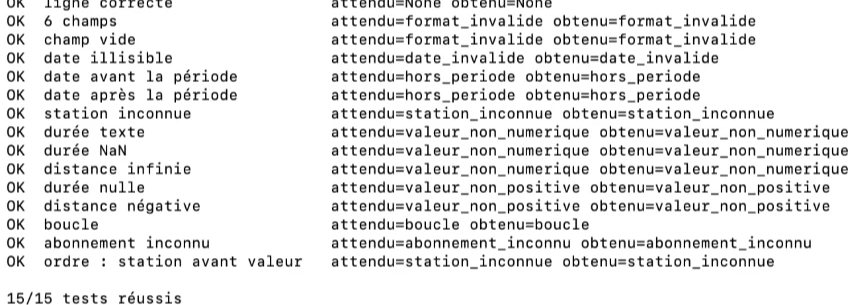
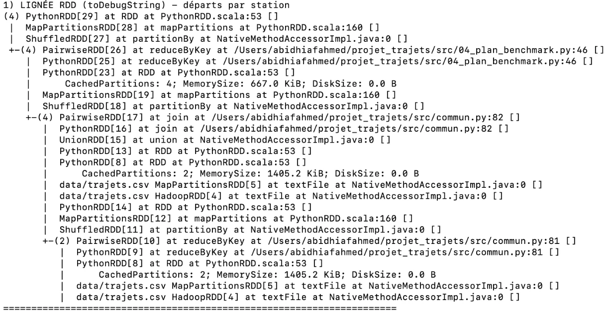
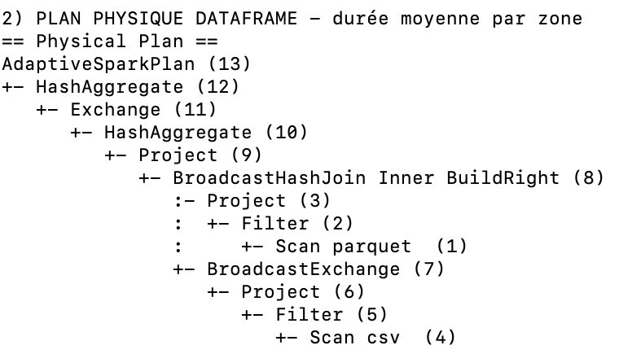

# 1. Introduction et environnement

Une entreprise de mobilité veut exploiter trois mois de trajets (janvier à mars 2026)
entre 36 stations réparties sur 3 zones. L'objectif est de construire une chaîne de
traitement reproductible avec Spark : lecture et contrôle qualité des CSV bruts, calcul
d'indicateurs avec l'API RDD puis l'API DataFrame, stockage analytique en Parquet, analyse
des plans d'exécution et construction d'un graphe orienté du réseau. Le projet est réalisé
en **PySpark**, dans un seul langage de bout en bout.

| Élément | Version |
|---|---|
| PySpark (pip) / moteur Spark affiché | 3.5.3 / 3.5.0 |
| Python | 3.12 |
| Java | 17.0.12 |
| Mode d'exécution | local[*] (macOS) |

Commande de lancement : voir README.

# 2. Ingestion et qualité des données

## 2.1 Structure des enregistrements
Chaque ligne valide devient un `namedtuple` Python `Trajet` (dans `src/commun.py`) avec
des champs nommés et typés après conversion :

| Champ | Type après conversion |
|---|---|
| `trajet_id`, `station_depart`, `station_arrivee`, `type_abonnement` | `str` |
| `date_heure` | `datetime` (format `%Y-%m-%d %H:%M:%S`) |
| `duree_min`, `distance_km` | `float` |

Les stations sont lues dans un `namedtuple` `Station` (zone en `int`, coordonnées en
`float`). La fonction `valider()` convertit une ligne et renvoie soit `("OK", Trajet)`,
soit `("REJET", motif)`, ce qui permet de séparer les lignes valides et rejetées avec un
simple `filter`. La liste des identifiants de stations est diffusée aux workers avec
`sc.broadcast` pour le contrôle des stations connues.

## 2.2 Règles de rejet

Les règles sont appliquées dans l'ordre ci-dessous ; une ligne reçoit le motif de la
première règle qu'elle viole, ce qui garantit valides + rejetées = lignes lues.

| Ordre | Motif | Règle |
|---|---|---|
| 1 | format_invalide | 7 champs non vides attendus |
| 2 | date_invalide | `date_heure` au format `yyyy-MM-dd HH:mm:ss` |
| 3 | hors_periode | date comprise entre le 01/01/2026 et le 31/03/2026 (les trois mois étudiés) |
| 4 | station_inconnue | départ et arrivée présents dans `stations.csv` |
| 5 | valeur_non_numerique | durée et distance convertibles en nombre **fini** (`nan` et `inf` refusés) |
| 6 | valeur_non_positive | durée > 0 et distance > 0 |
| 7 | boucle | station de départ ≠ station d'arrivée |
| 8 | abonnement_inconnu | `type_abonnement` ∈ {annuel, mensuel, occasionnel} |
| 9 | doublon_id | `trajet_id` unique (voir règle ci-dessous) |

Point de vigilance : en Python, `float("nan")` et `float("inf")` ne lèvent pas d'erreur,
et `nan <= 0` vaut `False`. Sans le test `math.isfinite`, une durée `nan` passerait toutes
les règles. Les règles 3 et 8 ne rejettent aucune ligne dans ce fichier, mais elles
protègent le pipeline contre des données futures.

**Tests unitaires.** `tests/test_regles.py` vérifie 15 cas limites sans Spark : un cas par
motif, `nan`, `inf`, distance négative, bornes exactes de la période, et l'ordre de priorité
des règles. Résultat : 15/15.

**Règle des doublons.** Lorsqu'un même `trajet_id` apparaît plusieurs fois, seule la
première occurrence dans l'ordre du fichier (numérotée avec `zipWithIndex`) est conservée.

Les deux lignes T000001 n'ont pas le même contenu : la ligne 2 est un trajet S08 → S19
le 2 janvier (40 min), la ligne 24006 un trajet S01 → S02 le 1er janvier à minuit (10 min).
Ce n'est donc pas une copie qu'on pourrait supprimer sans réfléchir, mais un conflit :
deux trajets différents avec le même identifiant. Il faut une règle pour choisir lequel garder.

Au moment de la lecture, `zipWithIndex` donne à chaque ligne son numéro de position dans le
fichier. Ce numéro ne change jamais, quelle que soit la façon dont Spark découpe les données
en partitions. En gardant toujours la plus petite position, on garde toujours la même ligne,
à chaque exécution : la règle est déterministe.

Garder la date la plus ancienne aurait été une autre option, mais elle conserverait ici la
ligne 24006 : une ligne de contrôle ajoutée en fin de fichier, datée pile de minuit le
1er janvier, donc suspecte.

L'énoncé précise que les cinq dernières lignes ne sont pas forcément les seules anomalies.
Avant d'écrire les règles, le script `00_exploration.py` a donc contrôlé tout le fichier :
nombre de colonnes (7 partout), champs vides (aucun), valeurs de `type_abonnement`
(uniquement annuel, mensuel, occasionnel), plage de dates (du 01/01 au 31/03/2026) et
vitesses moyennes (entre 7,2 et 16,8 km/h, réalistes). Aucune autre anomalie n'est apparue.

## 2.3 Bilan des rejets

| Motif | Lignes | N° de ligne de données |
|---|---|---|
| format_invalide, date_invalide, hors_periode, abonnement_inconnu | 0 | — |
| station_inconnue | 1 | 24002 (S99) |
| valeur_non_numerique | 1 | 24004 (durée = « inconnu ») |
| valeur_non_positive | 1 | 24001 (durée = 0) |
| boucle | 1 | 24003 (S03 → S03) |
| doublon_id | 1 | 24005 (T000001, déjà vu en ligne de données 1) |
| **Total rejeté** | **5** | |
| **Trajets valides** | **24 000** | |

Les numéros ci-dessus sont ceux affichés par le script (en-tête exclu) : la ligne de
données *n* correspond à la ligne *n + 1* du fichier CSV, celle qu'affiche `grep -n`.

## 2.4 Contrôle manuel
Quelques lignes du CSV ont été vérifiées à la main et comparées au résultat du pipeline :

| Ligne | Vérification manuelle | Attendu | Pipeline |
|---|---|---|---|
| T000002 | S26 et S04 existent, 36 min et 9,5 km positifs, S26 ≠ S04 | valide | valide ✅ |
| T000003 | S17 et S14 existent, 64 min et 14,38 km positifs, S17 ≠ S14 | valide | valide ✅ |
| T000001 (ligne 2) | première occurrence de l'identifiant | gardée | gardée ✅ |
| T000001 (ligne 24006) | identifiant déjà vu ligne 2 | rejetée | `doublon_id` ✅ |

Le pipeline donne exactement le résultat attendu (capture 01).

# 3. Indicateurs avec l'API RDD

Tous les indicateurs sont calculés sur les 24 000 trajets valides (script
`02_rdd_indicateurs.py`), puis enrichis avec le nom des stations par `join`.

## 3.1 Départs et arrivées par station

Un `flatMap` transforme chaque trajet en deux événements, `((départ, "depart"), 1)` et
`((arrivée, "arrivee"), 1)`, qui sont comptés par `reduceByKey` puis séparés par `filter`.
Le résultat complet (36 stations) est dans `output/rdd_departs_arrivees.csv`.

| | Min | Max |
|---|---|---|
| Départs | 633 (S30) | 724 (S14) |
| Arrivées | 633 (S04, S08) | 703 (S11, S19) |

Contrôle de cohérence : total des départs = total des arrivées = 24 000, le nombre de
trajets valides.

Contrôle manuel d'un indicateur : on recompte les départs de S01 directement dans le CSV,
sans Spark. `awk` trouve 650 lignes avec `station_depart = S01`, dont 3 lignes rejetées
(T024001, T024002 et le doublon T000001 de la dernière ligne). 650 − 3 = **647**, exactement
la valeur calculée par le pipeline.

## 3.2 Durée moyenne par zone de départ

Chaque trajet devient `(zone, (durée, 1))`. `reduceByKey` additionne les couples, et la
division n'est faite qu'à la fin : une moyenne de moyennes partielles serait fausse si les
partitions n'ont pas la même taille.

| Zone | Somme (min) | Trajets | Moyenne (min) |
|---|---|---|---|
| 1 | 315 584 | 7 902 | 39,94 |
| 2 | 318 854 | 8 091 | 39,41 |
| 3 | 317 285 | 8 007 | 39,63 |

Les trois zones ont des durées moyennes très proches, autour de 40 minutes.

## 3.3 Top 10 des couples départ–arrivée

| Rang | Départ | Arrivée | Trajets |
|---|---|---|---|
| 1 | S27 | S13 | 33 |
| 2 | S08 | S21 | 32 |
| 3 | S35 | S13 | 32 |
| 4 | S05 | S31 | 31 |
| 5 | S07 | S09 | 31 |
| 6 | S09 | S07 | 31 |
| 7 | S15 | S17 | 31 |
| 8 | S16 | S24 | 31 |
| 9 | S16 | S26 | 30 |
| 10 | S32 | S23 | 30 |

Quatre couples ont 30 trajets pour deux places restantes. Pour garder un classement
déterministe, les égalités sont départagées par ordre alphabétique (départ puis arrivée).
On remarque aussi que S07 → S09 et S09 → S07 sont tous les deux dans le top : c'est un axe
utilisé dans les deux sens.

# 4. API DataFrame et couche Parquet

## 4.1 Schéma explicite et indicateurs

Le script `03_dataframe_parquet.py` lit les CSV avec un `StructType` explicite : les types
(timestamp, double, string) sont déclarés au lieu d'être devinés par `inferSchema`. En mode
`PERMISSIVE`, une valeur non convertible comme la durée « inconnu » devient `null`, puis
est écartée par `dropna`. Les mêmes règles qu'en RDD sont réécrites avec des colonnes :
`left_semi` join pour les stations connues, `filter` pour les valeurs positives et les
boucles, et une fenêtre `row_number()` par `trajet_id` pour garder la première occurrence.
Résultat : **24 000 trajets valides**, comme en RDD.

Les trois indicateurs de la partie 3 ont été recalculés avec `groupBy` / `agg` / `join`.

## 4.2 Écriture Parquet partitionnée par mois

Une colonne `mois` (`yyyy-MM`) est ajoutée, puis les trajets nettoyés sont écrits avec
`partitionBy("mois")` dans `output/parquet/trajets/`. Spark crée un sous-dossier par mois ;
une requête filtrée sur un mois ne lit que le dossier concerné (*partition pruning*).

| Partition | Trajets |
|---|---|
| mois=2026-01 | 8 286 |
| mois=2026-02 | 7 375 |
| mois=2026-03 | 8 339 |
| **Total** | **24 000** |

La relecture du Parquet redonne bien 24 000 trajets.

## 4.3 Comparaison RDD / DataFrame

Le script compare automatiquement les sorties des deux versions : départs/arrivées, durée
moyenne par zone et top 10 sont **identiques** (`True` pour les trois).

| Critère | RDD | DataFrame |
|---|---|---|
| Schéma | implicite (namedtuple Python, types vérifiés à la main) | explicite (`StructType`), vérifié à la lecture |
| Conversion / erreurs | `try/except` dans une fonction Python | `null` en mode PERMISSIVE, puis `dropna` |
| Lisibilité | tuples imbriqués (`kv[1][0][2]`), plus difficile à relire | colonnes nommées, proche du SQL |
| Optimisation | aucune : Spark exécute exactement le code écrit | optimiseur Catalyst (plan logique → physique) |
| Contrôle | total, bas niveau | moins fin mais suffisant ici |
| Résultats | référence | identiques ✅ |

En pratique, la version DataFrame est plus courte et plus lisible : les colonnes ont un nom,
le schéma est contrôlé dès la lecture, et Catalyst optimise le plan sans intervention.
La version RDD reste utile pour comprendre ce que Spark fait réellement (chaque `map`,
chaque shuffle est écrit explicitement) et pour les traitements difficiles à exprimer en
colonnes, comme la validation ligne par ligne avec un motif de rejet précis. Dans ce projet,
les deux API donnent exactement les mêmes résultats.

# 5. Plan d'exécution et optimisation

## 5.1 Transformations étroites et larges

Une transformation **étroite** calcule chaque partition de sortie à partir d'une seule
partition d'entrée : pas d'échange réseau. Une transformation **large** a besoin des données
de plusieurs partitions : Spark doit faire un *shuffle* et démarre un nouveau stage.

| Transformation (où dans le pipeline) | Type | Shuffle ? |
|---|---|---|
| `map` (parsing et validation, `commun.py`) | étroite | non |
| `filter` (séparation valides / rejets) | étroite | non |
| `flatMap` (événements départ/arrivée, étape 2) | étroite | non |
| `mapValues` (couples (durée, 1)) | étroite | non |
| `reduceByKey` (comptages, sommes) | large | oui |
| `join` (doublons, enrichissement avec les noms) | large | oui |
| `groupByKey` (benchmark) | large | oui |
| `groupBy().agg()` (DataFrame) | large | oui (`Exchange`) |

## 5.2 Lecture du plan et de l'interface Spark

**Lignée RDD (`toDebugString`, capture 07).** Chaque `+-` marque une frontière de stage,
c'est-à-dire un shuffle. Pour le simple comptage des départs, on voit trois shuffles : le
`reduceByKey` de la détection des doublons, le `join` qui garde la première
occurrence et le `reduceByKey` final. Les lignes `CachedPartitions`
montrent que le RDD des trajets valides est lu depuis la mémoire (667 Kio) au lieu d'être
recalculé.

**Plan physique DataFrame (`explain`, capture 07b).** Pour la durée moyenne par zone,
Catalyst produit :

- un `Scan parquet` qui ne lit que les 2 colonnes utiles (`ReadSchema:
  struct<station_depart, duree_min>`) : c'est l'avantage du format colonne ;
- un `BroadcastHashJoin` : la petite table des 36 stations est envoyée à chaque tâche
  (`BroadcastExchange`), ce qui évite un shuffle de la grande table ;
- un `HashAggregate` partiel (`partial_avg` = somme + nombre par partition), puis un seul
  `Exchange hashpartitioning(zone, 200)`, puis l'agrégat final. C'est exactement le principe
  (somme, nombre) de la partie 3.2, appliqué automatiquement.

**Interface Spark (capture 08).** L'onglet *Stages* montre les colonnes *Shuffle
Write* et *Shuffle Read*. Par exemple, le comptage des départs par station n'écrit que
2,1 Kio de shuffle, alors que le comptage des couples départ–arrivée en écrit 45,1 Kio : il
y a beaucoup plus de clés distinctes (1 260 couples distincts contre 36 stations).

## 5.3 groupByKey vs reduceByKey, partitionnement et cache

Les mesures ont été faites sur le même Mac, en `local[*]`, avec 1 exécution d'échauffement
puis 5 exécutions chronométrées par variante (`output/benchmark.csv`).

| Variante | Run 1 | Run 2 | Run 3 | Run 4 | Run 5 | Médiane (s) |
|---|---|---|---|---|---|---|
| RDD groupByKey | 0,094 | 0,096 | 0,089 | 0,086 | 0,091 | **0,091** |
| RDD reduceByKey | 0,085 | 0,089 | 0,085 | 0,084 | 0,089 | **0,085** |
| DataFrame – 200 partitions de shuffle | 0,018 | 0,015 | 0,016 | 0,016 | 0,015 | **0,016** |
| DataFrame – 8 partitions de shuffle | 0,017 | 0,016 | 0,016 | 0,016 | 0,017 | **0,016** |
| Deux indicateurs sans cache | 0,205 | 0,210 | 0,208 | 0,199 | 0,199 | **0,205** |
| Deux indicateurs avec cache | 0,170 | 0,175 | 0,167 | 0,170 | 0,169 | **0,170** |

Volume écrit par le shuffle, relevé via l'API REST de l'interface Spark
(`output/shuffle_volumes.csv`) :

| Variante | Shuffle write |
|---|---|
| groupByKey | 74 963 octets (73,2 Kio) |
| reduceByKey | 3 087 octets (3,0 Kio) |

**groupByKey vs reduceByKey.** Les temps sont très proches (6 ms d'écart sur la médiane),
mais le volume échangé est environ **24 fois plus faible** avec `reduceByKey`. En effet,
`groupByKey` envoie les 24 000 durées sur le réseau avant de les additionner, alors que
`reduceByKey` combine d'abord localement dans chaque partition et n'envoie qu'un couple
(somme, nombre) par station et par partition. Sur 24 000 lignes et une seule machine, ce
gain ne se voit presque pas en temps ; sur un vrai cluster, le shuffle passe par le réseau
et le disque, et c'est lui qui coûte le plus cher.

**Partitionnement.** Par défaut, un shuffle DataFrame crée 200 partitions, beaucoup trop
pour 3 zones. Avec 8 partitions, le temps ne change pas ici, car l'*Adaptive Query
Execution* (`AdaptiveSparkPlan` dans le plan) fusionne automatiquement les partitions vides
après le shuffle. Côté RDD, le fichier est lu en 2 partitions puis 4 après les jointures :
ce nombre fixe le parallélisme maximal (une tâche par partition, visible dans la colonne
*Tasks 4/4*).

**Cache.** Sans `cache()`, chaque action relit le CSV et refait toute la validation (parsing,
doublons, jointure). Avec le cache, les deux indicateurs repartent du RDD en mémoire :
médiane de 0,205 s à 0,170 s, soit environ 17 % de moins. Le cache est pertinent ici parce
que le même RDD nettoyé est réutilisé par plusieurs indicateurs.

**Limite.** Ces mesures portent sur un petit jeu de données, sur une seule machine, et les
écarts sont de quelques millisecondes. Elles ne prouvent pas une accélération générale :
elles illustrent seulement des mécanismes (volume de shuffle, recalcul évité) qui
deviennent importants à plus grande échelle.

# 6. Graphe orienté du réseau

Le graphe est construit en RDD (`05_graphe.py`) : les **sommets** sont les 36 stations, et
chaque **arc** `départ → arrivée` porte comme poids le nombre de trajets, obtenu par
`reduceByKey` sur les couples `((départ, arrivée), 1)`. Résultat : 36 sommets,
**1 260 arcs**, pour un poids total de 24 000 trajets.

**Constat important.** 1 260 = 36 × 35 : le graphe est **complet**. Chaque station envoie et
reçoit des trajets de toutes les autres, donc tous les degrés non pondérés valent 35
(entrant et sortant). Le degré simple ne permet pas de distinguer les stations.

**Définition annoncée.** Une station est d'autant plus connectée que son **degré total
pondéré** est élevé, c'est-à-dire le nombre de trajets entrants + sortants. En cas
d'égalité, on départage par le degré non pondéré, puis par l'identifiant.

| Rang | Station | Zone | Entrants | Sortants | Degré total pondéré |
|---|---|---|---|---|---|
| 1 | S25 | 3 | 693 | 716 | **1 409** |
| 2 | S14 | 2 | 665 | 724 | **1 389** |
| 3 | S02 | 1 | 688 | 686 | **1 374** |
| 4 | S16 | 2 | 662 | 711 | **1 373** |
| 5 | S07 | 1 | 697 | 672 | **1 369** |

Ces valeurs sont cohérentes avec la partie 3.1 : pour S25, 716 départs + 693 arrivées =
1 409. Les trois zones sont représentées dans le top 5, et les écarts restent faibles
(1 369 à 1 409, soit moins de 3 %) : le réseau synthétique est très homogène. Les arcs les
plus lourds sont les mêmes que le top 10 de la partie 3.3 (S27 → S13 : 33 trajets).
Les degrés complets et la liste des arcs sont dans `output/graphe_degres.csv` et
`output/graphe_arcs.csv`.

# 7. Limites et conclusion

Le pipeline va des CSV bruts jusqu'aux indicateurs et au graphe, de façon reproductible :
5 lignes sont rejetées avec un motif explicite, 24 000 trajets sont validés, et les
versions RDD et DataFrame donnent des résultats identiques. Les données nettoyées sont
stockées en Parquet partitionné par mois.

Limites :

- **Données synthétiques et homogènes.** Le graphe complet et les durées moyennes quasi
  identiques par zone montrent un réseau sans vraie structure. Sur des données réelles, les
  différences entre stations seraient plus marquées.
- **Mesures de performance.** Elles sont faites sur un seul Mac en mode local, avec un petit
  volume : elles illustrent des mécanismes (volume de shuffle, cache) sans prouver un gain
  général.
- **Règle des doublons.** « Première occurrence » est déterministe mais repose sur l'ordre
  du fichier. En RDD, `zipWithIndex` le garantit ; en DataFrame, `monotonically_increasing_id`
  le respecte ici parce qu'il n'y a qu'un seul fichier source. Si les données arrivaient de plusieurs fichiers, il faudrait une autre clé
  d'ordre, par exemple une date d'ingestion.
- **Pas de table transactionnelle.** Le Parquet ne gère ni mises à jour ni historique. Une
  couche Delta Lake ou Iceberg serait l'étape suivante pour un vrai lakehouse.
